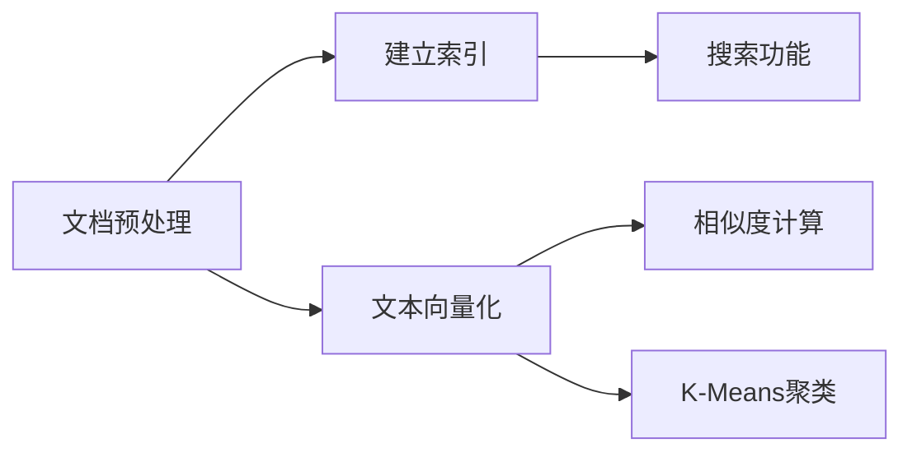

本地文档搜索及相似度比较

## 1. 要求
### (一) 建立并实现文本搜索功能
1. 使用ElasticSearch实现文本搜索引擎
2. 对500个中英文文档建立索引并实现搜索功能
3. 通过网页前端展示搜索结果
4. 支持中英文搜索

### (二) 比较文档之间的相似度
1. 通过余弦距离计算任意两个文档的相似度
2. 实现文档查重功能

### (三) 文档聚类
1. 使用K-Means算法将文档聚为20类
2. 比较不同聚类数量(5/10/25/50)的效果
3. 显示每个类的代表性文档

## 2. 实验环境
### 硬件环境
- 计算机：XPS 13 9305
- CPU: 11th Gen Intel Core i7-1165G7 @ 2.80GHz
- RAM：16GB

### 软件环境
- 操作系统：Windows11
- 开发工具：PyCharm 2022.2.5
- 主要技术栈：
  - Elasticsearch 8.5+
  - Python Flask
  - HTML5 + CSS3
  - scikit-learn

## 3. 实验步骤及结果

### 3.1 文本搜索功能实现
#### 技术路线
- 搜索引擎：Elasticsearch 8.5+
- 后端框架：Python Flask
- 前端技术：HTML5 + CSS3

#### 关键步骤
1. **环境准备**
   - 下载安装Elasticsearch
   - 安装必要的Python包
   ```python
   from elasticsearch import Elasticsearch
   import os
   ```

2. **建立索引**
   - 初始化ES连接
   ```python
   es = Elasticsearch(hosts=["http://localhost:9200"])
   ```
   - 核心索引函数
   ```python
   def index_documents(doc_dir, index_name, language):
       for filename in os.listdir(doc_dir):
           if filename.endswith(".txt"):
               with open(os.path.join(doc_dir, filename), 'r', encoding='utf-8') as f:
                   content = f.read()
               doc = {"title": filename, "content": content, "language": language}
               es.index(index=index_name, body=doc)
   ```

3. **搜索服务实现**
   - 后端搜索逻辑
   ```python
   @app.route('/search')
   def search():
       query = request.args.get('q', '')
       lang = request.args.get('lang', 'chinese')
       body = {"query": {"match": {"content": query}}, "highlight": {...}}
       resp = es.search(index=f"docs_{lang}", body=body)
       return render_template('results.html', results=resp['hits']['hits'], query=query)
   ```

#### 搜索结果展示
- **中文搜索**  
  关键词："我" → 返回相关文档并高亮显示匹配内容
- **英文搜索**  
  关键词："china" → 返回相关英文文档

### 3.2 文档相似度比较
#### 技术路线
- 文本向量化：TF-IDF
- 相似度计算：余弦距离
- 界面框架：Tkinter

#### 系统架构
```
文档加载 → 文本向量化 → 余弦相似度计算 → 双文档对照显示
```

#### 关键步骤
1. **文档预处理**
   ```python
   def load_documents(self):
       file_paths = glob.glob(os.path.join(self.doc_dir, "*.txt"))
       for file_path in file_paths:
           with open(file_path, 'r', encoding='utf-8') as f:
               content = f.read()
           filename = os.path.basename(file_path)
           self.docs[filename] = content
           self.filenames.append(filename)
   ```

2. **文本向量化**
   ```python
   def vectorize_documents(self):
       vectorizer = TfidfVectorizer()
       tfidf_matrix = vectorizer.fit_transform(self.docs.values())
       self.cos_sim = cosine_similarity(tfidf_matrix, tfidf_matrix)
   ```

3. **相似度计算**
   ```python
   similarity = self.cos_sim[idx1][idx2]
   distance = 1 - similarity
   ```

#### 测试结果
| 测试用例               | 预期结果         | 实际结果 |
|------------------------|------------------|----------|
| 相同文档比对           | 相似度=1，距离=0 | 通过     |
| 完全无关文档比对       | 相似度≈0，距离≈1 | 通过     |
| 主题相同文档比对       | 0<相似度<1       | 通过     |

### 3.3 文档聚类分析
#### 技术路线
- 算法：K-Means聚类
- 向量化：TF-IDF
- 评估指标：轮廓系数

#### 实验步骤
1. **数据预处理**
   ```python
   def load_documents(path):
       filenames = []
       documents = []
       for filename in os.listdir(path):
           if filename.endswith('.txt'):
               with open(os.path.join(path, filename), 'r', encoding='utf-8') as f:
                   content = f.read()
               documents.append(content)
               filenames.append(filename)
       return filenames, documents
   ```

2. **文本向量化**
   ```python
   def vectorize_documents(documents):
       vectorizer = TfidfVectorizer(norm='l2', max_features=10000)
       X = vectorizer.fit_transform(documents)
       return X, vectorizer
   ```

3. **K-Means聚类**
   ```python
   k = 20
   kmeans = KMeans(n_clusters=k, random_state=42)
   kmeans.fit(X)
   labels = kmeans.labels_
   ```

#### 聚类结果分析
**英文文档聚类(k=20)**
- 最大类（197个文档）代表性文件：
  - Enbook_975_New.txt
  - Enbook_929_New.txt
  - Enbook_974_New.txt

**中文文档聚类(k=20)**
- 最大类（135个文档）代表性文件：
  - News_62_Org.txt
  - News_67_Org.txt
  - News_55_Org.txt

#### 不同k值效果对比
| k值 | 轮廓系数 | 最大类 | 最小类 | 平均类大小 |
|-----|----------|--------|--------|------------|
| 5   | 0.02     | 620    | 35     | 200.2      |
| 10  | 0.03     | 345    | 9      | 100.1      |
| 25  | 0.03     | 275    | 5      | 40.0       |
| 50  | 0.04     | 164    | 2      | 20.0       |

## 4. 实验总结
本次实验实现了：
1. 基于ElasticSearch的中英文文档搜索引擎
2. 文档相似度计算与查重系统
3. K-Means文档聚类分析

关键发现：
- 当聚类数接近真实主题数量(~20)时轮廓系数最优
- 文本向量化质量直接影响聚类效果
- ElasticSearch能有效处理中英文混合检索


